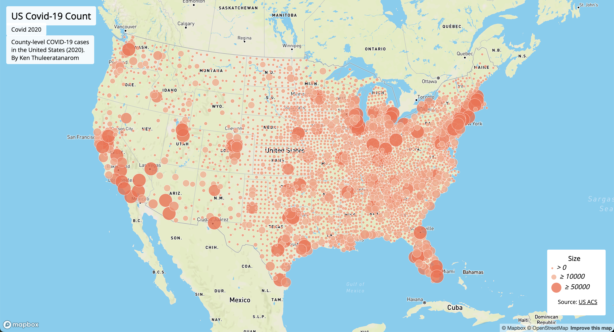
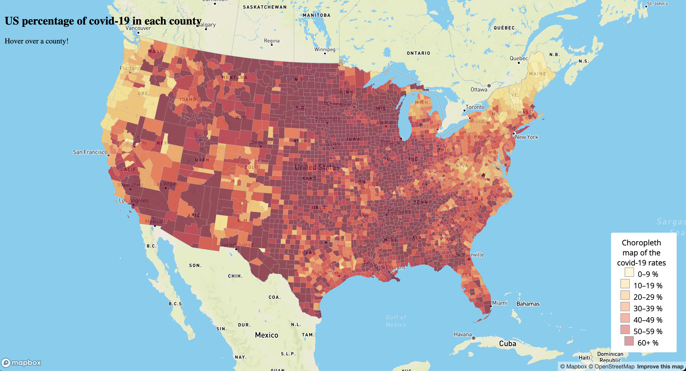

# COVID-19 in the United States (2020)  
### Proportional Symbol Map & Choropleth Map Detailing Covid-19 in the US

## Project Overview
This project visualizes county-level COVID-19 data across the United States for the year 2020 using two map types:

1. **Proportional Symbol Map** showing total COVID-19 case counts by county  
2. **Choropleth Map** showing COVID-19 case rates normalized by population  

Each of these have thier own use and functions for further analysis regarding Covid-19 in the year 2020

---

## Link to the Maps
- **Proportional Symbol Map (Counts)**  
  👉 *[Proportional Symbol Map](https://kenatv.github.io/covid-19Lab3/map2.html)*

- **Choropleth Map (Rates)**  
  👉  *[Choropleth Map](https://kenatv.github.io/covid-19Lab3/map1.html)*

---

## Maps
### Proportional Symbol Map

### Choropleth Map

---

## Primary Functions & Features

### Core Features
- Proportional circle symbols scaled by COVID-19 case counts
- Choropleth classification using COVID-19 case rates
- Interactive hover and click behavior
- Dynamic legends for both maps
- Custom map overlays for titles, legends, and descriptions

### Functions Beyond Lecture Content
- **Asynchronous data loading** using `fetch()` with `async/await`
- **Mapbox expression-based styling** using `step` expressions

---

## Libraries in use
- **Mapbox GL JS**
- **HTML**
- **CSS**
- **JavaScript**
- **Google Fonts (Open Sans)**

---

## Data Sources
- COVID-19 county-level case and death data (2020)
- U.S. Census population data (2018 estimates)

---

## Acknowledgement

- U.S. Census Bureau
- COVID-19 open data providers
- MapBox
- MapShaper
- Github

---

## Author
**Ken Thuleeratanarom**  
Geography 458 Project Lab 3

